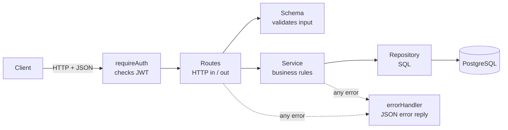
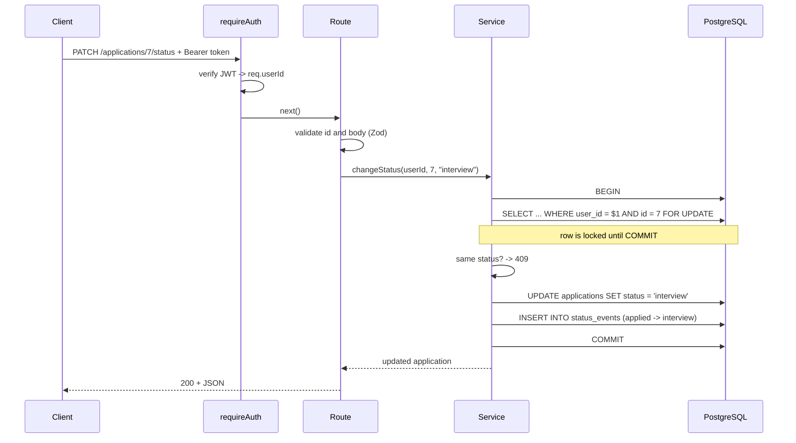
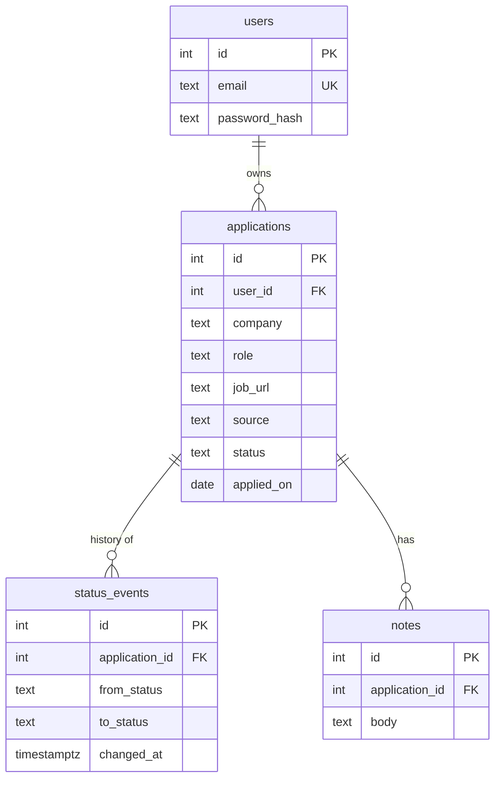

# Safar

A backend API for tracking my job applications: where I applied, what stage each one
is at, and which sources actually lead to interviews.

I was keeping this in a spreadsheet and kept losing track of which companies had
replied, which had ghosted me, and which job boards were worth the time. Safar keeps
every application, every status change and my notes, and turns them into numbers.

*Safar* means journey. A job hunt is one, and this keeps every step of it.

> **Status:** runs locally. Not deployed yet.

## What it does

- Save applications with company, role, link, source (LinkedIn, Naukri, referral...)
  and the date I applied.
- Move them through `saved -> applied -> interview -> offer / rejected / ghosted`.
  Every change is recorded with a timestamp.
- Add notes to an application ("HR call on Monday", "asked about indexes").
- Filter by status, company and date range, with pagination.
- Stats: applications this week, response rate, and interviews per source.
- Accounts with hashed passwords and JWT auth. Each user only sees their own data.

## Stack

Node.js, Express 5, PostgreSQL (`pg`, plain SQL), Zod for validation, bcrypt + JWT
for auth. Tests use Node's built-in test runner and Supertest against a real
Postgres database.

## Architecture

Every feature is split into the same four layers. Each layer has one job and only
talks to the layer below it.



| Layer | Knows about | Doesn't know about |
|---|---|---|
| Routes | HTTP: params, body, status codes | SQL |
| Schema | Shape of valid input | Database, HTTP |
| Service | Rules ("status can't be set twice", "history is always written") | HTTP |
| Repository | SQL and table/column names | HTTP, business rules |

Because of this split, swapping the database would only touch the repositories, and
the rules can be read in one place without SQL in the way.

## How a request flows

What happens on `PATCH /applications/7/status` with `{"status": "interview"}`:



If anything fails along the way, the error travels to `errorHandler`, which
answers with a clean JSON error instead of crashing:

| Problem | Response |
|---|---|
| No token, bad token, expired token | `401` |
| Invalid body or query (Zod) | `400` with the field that's wrong |
| Malformed JSON | `400 invalid JSON` |
| Application doesn't exist **or belongs to someone else** | `404` |
| Status is already the one requested / email already registered | `409` |
| Anything unexpected | `500`, logged on the server, details never sent to the client |

## Data model



- `status` is limited to the six allowed values by a `CHECK` constraint, so bad data
  can't get in even if the API had a bug.
- Deleting an application deletes its history and notes (`ON DELETE CASCADE`).
- Indexes on `(user_id, status)` and `(user_id, applied_on)` match how the list is
  filtered and sorted.

## Design decisions

- **Status only changes through its own endpoint.** `PATCH /applications/:id` refuses
  a `status` field. That way every change goes through one place and lands in
  `status_events`.
- **Status change + history entry happen in one transaction**, with the application
  row locked (`SELECT ... FOR UPDATE`). Either both are saved or neither is, and two
  requests can't change the same application at the same time.
- **Stats use the history, not just the current status.** An application that went
  `interview -> rejected` still counts as an interview for its source.
- **Other users' data returns 404, not 403**, so the API doesn't confirm that an id
  exists.
- **Passwords are hashed with bcrypt**, never stored. Login returns a JWT that
  expires in 7 days.
- **Dates are kept as `YYYY-MM-DD` strings** instead of JS `Date` objects, which would
  shift them by the timezone.
- **Plain SQL instead of an ORM**, so every query is visible and easy to check with
  `EXPLAIN`.

## Project structure

```
src/
  server.js           starts the server
  app.js              Express setup, routes, error handler
  config.js           reads environment variables
  db/
    pool.js           Postgres pool + transaction helper
    migrate.js        runs each SQL file in db/migrations once
    migrations/       table definitions
  middleware/
    requireAuth.js    checks the JWT
    errorHandler.js   turns errors into JSON responses
  modules/
    auth/             register, login
    applications/     applications, status history, notes
    stats/            aggregate queries
tests/                API tests against a real test database
```

## Running it locally

Needs Node 22+ and PostgreSQL.

```bash
npm install
cp .env.example .env        # then fill in your Postgres password and a JWT secret
createdb safar
createdb safar_test
npm run migrate
npm run dev
```

The API runs on `http://localhost:3000`.

## Tests

```bash
npm test
```

24 tests send real HTTP requests to the app and check the responses and the
database. They cover auth, validation, filters, status history, notes, stats, and
one user trying to read or change another user's data. They run against
`safar_test`, which is wiped at the start of each test file, so they never touch
real data.

## API

All routes except `/health` and `/auth/*` need `Authorization: Bearer <token>`.

| Method | Path | Description |
|---|---|---|
| GET | `/health` | Health check |
| POST | `/auth/register` | Create an account |
| POST | `/auth/login` | Get a token |
| GET | `/applications` | List. Query: `status`, `company`, `from`, `to`, `limit`, `offset` |
| POST | `/applications` | Add an application |
| GET | `/applications/:id` | One application with its notes and status history |
| PATCH | `/applications/:id` | Edit company, role, link, source or date |
| PATCH | `/applications/:id/status` | Change status (recorded in history) |
| DELETE | `/applications/:id` | Delete |
| POST | `/applications/:id/notes` | Add a note |
| GET | `/stats` | Totals, response rate, counts by status and by source |

Example:

```bash
curl -X POST http://localhost:3000/applications \
  -H "Authorization: Bearer $TOKEN" \
  -H "Content-Type: application/json" \
  -d '{"company":"Acme","role":"Backend Developer","source":"linkedin","status":"applied"}'
```

```json
{
  "id": 1,
  "company": "Acme",
  "role": "Backend Developer",
  "jobUrl": null,
  "source": "linkedin",
  "status": "applied",
  "appliedOn": "2026-10-07",
  "createdAt": "2026-10-07T06:47:11.631Z",
  "updatedAt": "2026-10-07T06:47:11.631Z"
}
```
